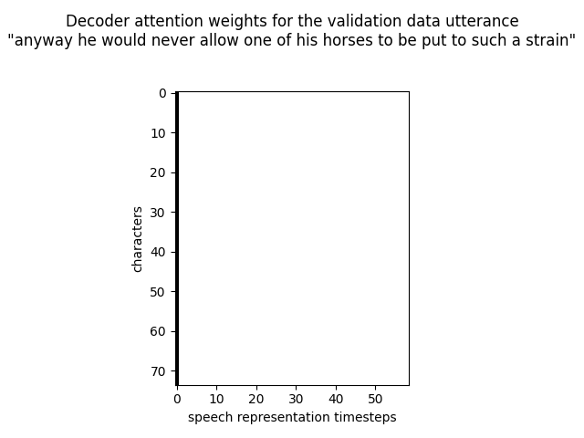

# Listen-Attend-Spell
<b>Implementation</b>

Implemented in TensorFlow 2.3.0 directly from the paper (<a href=https://arxiv.org/abs/1508.01211>Chan, et al. 2015</a>).  Since I don't have a room simulator I replaced that component of the system with a waveform augmentation function which randomly shifts, scales, and adds noise to every waveform every time it is used.

The system in the paper was trained on an internal dataset containing 3 million utterances for 2 weeks on 32 DistBelief replicas.  My system was trained on 28 thousand utterances from the <a href=https://www.openslr.org/12>LibriSpeech</a> corpus for 8 hours on a gaming laptop.

The differences in training may explain the difference in results.  While the paper obtained a 14.1% word error rate decoding on a separate test set, my system achieves a 55.1% character accuracy rate on validation data when (mostly) teacher-forcing the previous character.

Example of next character prediction when teacher forcing the previous character:

<pre>
predicted : 'and hy te wauld hover hllow hn  of tis seuse  ao te art oh tech a strang '
target    : 'anyway he would never allow one of his horses to be put to such a strain$'
</pre>

Example of pure decoding, from logmels and the start-of-sentence token:

<pre>
decoded : 'and the strange property of the state of the state of the state of the state of the state of the state of the state of the state of the state of the state of the state of the state of the state of the state of the state of the state of the state of the state of the state of the state of the state of'
target  : 'anyway he would never allow one of his horses to be put to such a strain$'
</pre>

I also plotted the decoder-listener attention weights for this sentence, when teacher forcing the previous character, finding that every character attends to the 1st acoustic timestep:

My code is in <a href=listenattendspell.py>listenattendspell.py</a>, and the TensorBoard training curve in <a href=TensorBoardTrain.png>TensorBoardTrain.png</a>.

Both the attention weights and the decoded text suggest that the speller is ignoring the acoustics.  This problem was mentioned in the original LAS paper (top of page 2).  I explore possible solutions in <a href=https://github.com/redonovan/LAS-Variations>Listen Attend Spell Variations</a>.
